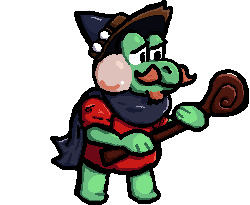
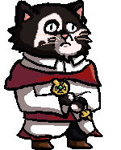
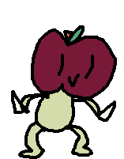
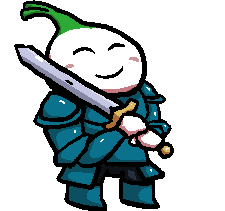

# Short Rest






## Scripts

```sh
npm i # setup
npm start # dev server
npm run build:prod # make build
npm run build # optimize image assets (slow) + make build
```

## Game files

- [`./src/assets/cards.txt`](./src/assets/cards.txt): card definitions + scene cheat sheet
- [`./src/assets/obstacles.txt`](./src/assets/obstacles.txt): obstacle definitions
- [`./src/assets/levels.txt`](./src/assets/levels.txt): level generation
- [`./src/assets/assets.txt`](./src/assets/assets.txt): list of files to load

These are all loaded dynamically at runtime, so you can take a single build and edit them + reload instead of using the dev server.

`cards`, `obstacles`, and `levels` are named `.txt` for annoying build reasons but are actually JS and indirectly `eval`d by the game.

## Mechanics

### `Advance` order of operations

- if there are no obstacles:
  1. moves to next area
  2. if there is an obstacle, and the obstacle has a `start`, trigger the `start`
- if there is an obstacle:
  1. if the obstacle has health, deal damage to obstacle
     - if the obstacle died:
       1. queue death animation
       2. if the obstacle has an `end`, trigger the `end`
  2. if the obstacle has an `interact`, trigger the `interact`
  3. if the obstacle has damage, deal damage to front

Note that because of how `interact`, `end`, and the action queue work, if an obstacle dies during `Advance` the order will be:

> damage > `interact` > death animation > `end`

To avoid triggering `interact` during the turn an obstacle dies, add `if (!this.health) return;` to the top of the function.

### Other

- All interaction is player-driven: enemies don't attack, they just react to the player's `Advance`.
- `end` will also be triggered when an obstacle is killed through cards or as a result of another `interact`.
- Armour: each point of armour blocks a single hit (regardless of damage)
- Obstacles without starting health will never die as a result of damage: they need to be killed via `killObstacle` in their `interact`
